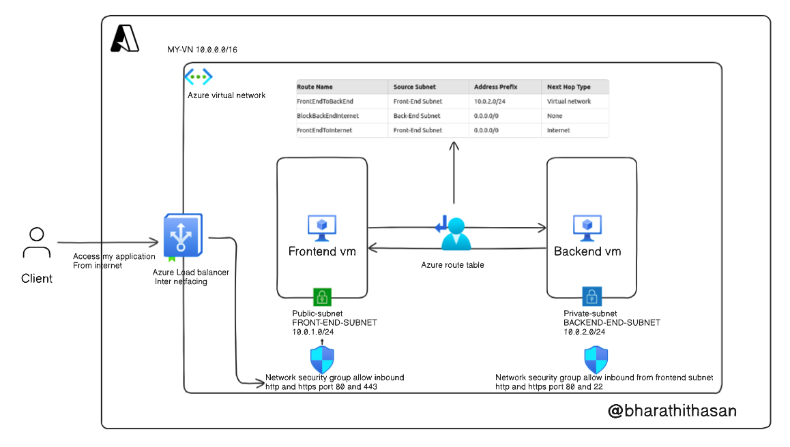
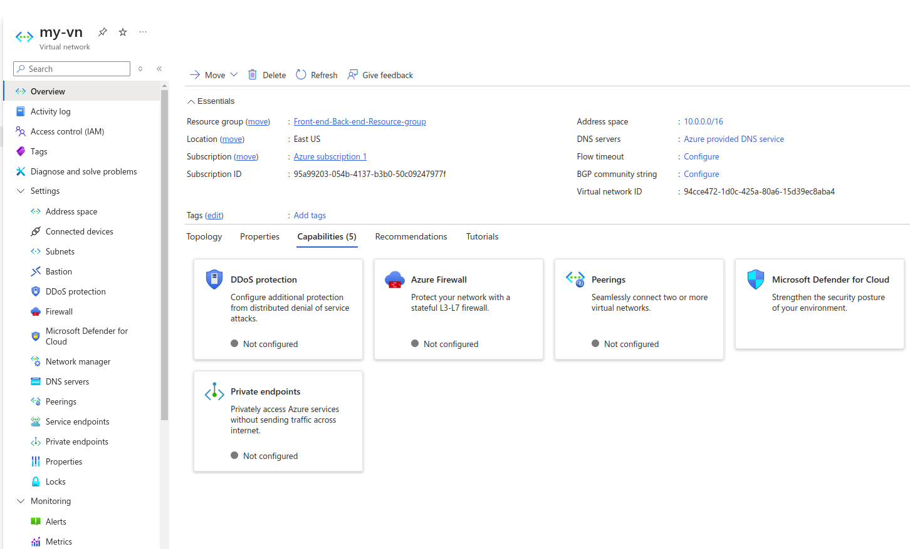
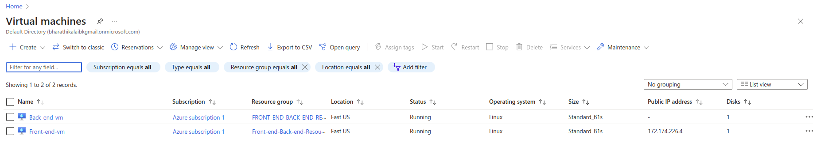
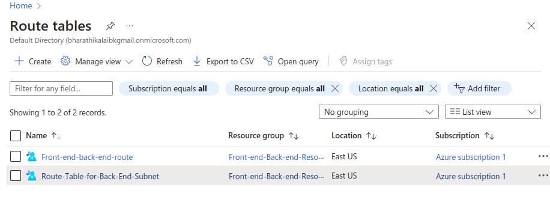
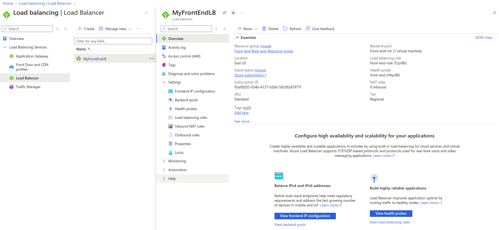

# Azure frontend and backend architecture

# Step 1: 

### Create a Virtual Network (VNet)

In the Azure portal, go to Create a resource.

Search for Virtual Network and click Create.

Fill in the Basics:

Subscription: Choose your subscription.
Resource group: Create a new resource group or use an existing one.
Name: Provide a name for your VNet (e.g., MyVNet).
Region: Select a region where the resources will be deployed.
In the IP Addresses section:

Set the Address space to something like 10.0.0.0/16 (you can customize this as needed).
Create Subnets:

Front-End Subnet: Add a subnet (e.g., FrontEndSubnet) with the address range 10.0.1.0/24.
Back-End Subnet: Add another subnet (e.g., BackEndSubnet) with the address range 10.0.2.0/24.
Click Review + Create to create the VNet.

# Step 2:
### Step 2: Create Front-End VM (with Public IP)  & Create Back-End VM (in Private Subnet)

Go to Create a resource and search for Virtual Machine.

In the Basics tab:

Resource group: Select the resource group you used for the VNet.
Name: Give it a name (e.g., FrontEndVM).
Region: Select the same region as your VNet.
Availability options: Choose availability zones or sets based on your preference.
Image: Choose an operating system (e.g., Ubuntu or Windows).
Size: Select the appropriate size based on your workload.
Authentication type: Choose between SSH or Password for login credentials.
In the Networking tab:

Virtual network: Select the VNet you created (MyVNet).
Subnet: Select the FrontEndSubnet.
Public IP: Ensure that a new public IP is created for this VM.
NIC network security group: Choose Basic and allow only selected ports (e.g., HTTP 80 or HTTPS 443 for web traffic).
Click Review + Create and create the VM.

Go to Create a resource and search for Virtual Machine.

In the Basics tab:

Resource group: Select the same resource group as before.
Name: Name this VM BackEndVM.
Region: Choose the same region as your VNet.
Image: Select the OS of your choice.
Size: Pick the size based on your workload.
Authentication type: Choose between SSH or Password.
In the Networking tab:

Virtual network: Select MyVNet.
Subnet: Select the BackEndSubnet (this subnet doesn’t have a public IP).
Public IP: Select None (this VM will only have a private IP).
NIC network security group: You can allow specific traffic (like SSH, HTTP) only from the front-end subnet using NSG rules.
Click Review + Create and create the VM.

# Step 3
### Use Multiple Route Tables
If you need different routing configurations, you can use separate route tables:

Route Table for Front-End Subnet

Route Name: FrontEndRoutes
Route for Internet Access:
Address Prefix: 0.0.0.0/0
Next Hop Type: Internet
Route for Back-End Subnet:
Address Prefix: 10.0.2.0/24
Next Hop Type: Virtual network
Route Table for Back-End Subnet

Route Name: BackEndRoutes
Route to Block Internet Access:
Address Prefix: 0.0.0.0/0
Next Hop Type: None
Route to Allow Traffic from Front-End:
Address Prefix: 10.0.1.0/24 (Front-End subnet’s address range)
Next Hop Type: Virtual network

# Step 4: Add a Load Balancer
Go to Create a resource and search for Load Balancer.

In the Basics tab:

Resource group: Use the same resource group.
Name: Give it a name (e.g., MyFrontEndLB).
SKU: Select Standard.
Type: Choose Public.
Region: Select the same region as the VNet.
Public IP address: Create a new one for your load balancer.
In the Backend pools section:

Add your FrontEndVM to the backend pool.
Set up health probes and load-balancing rules to distribute traffic evenly among your front-end VMs

