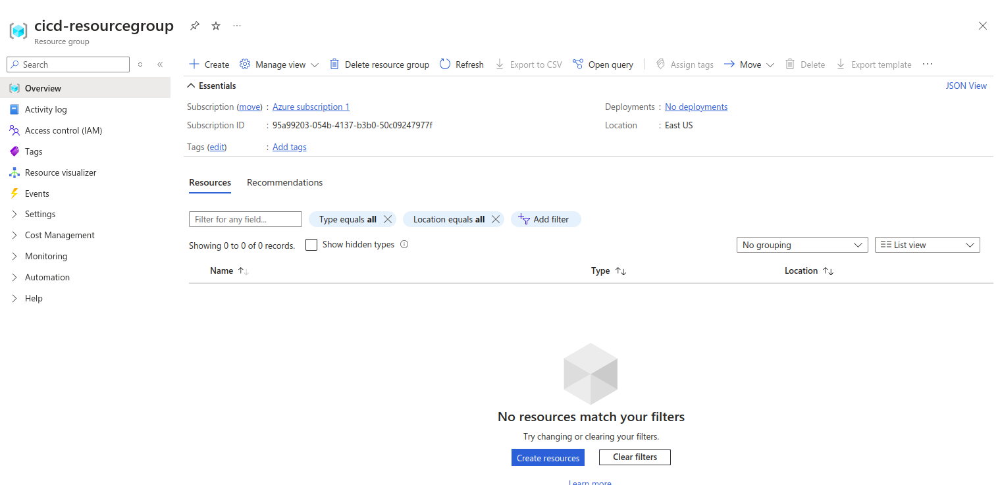
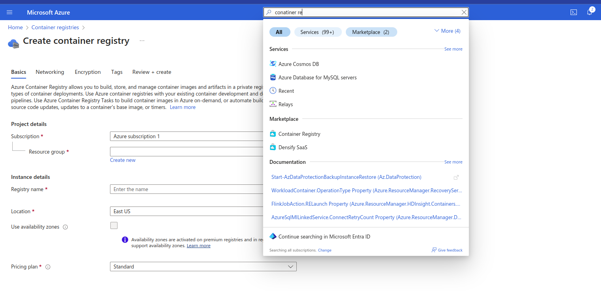
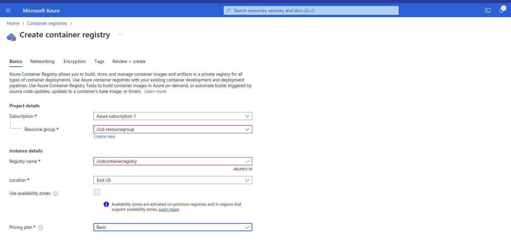
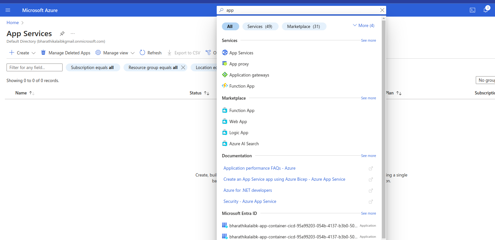
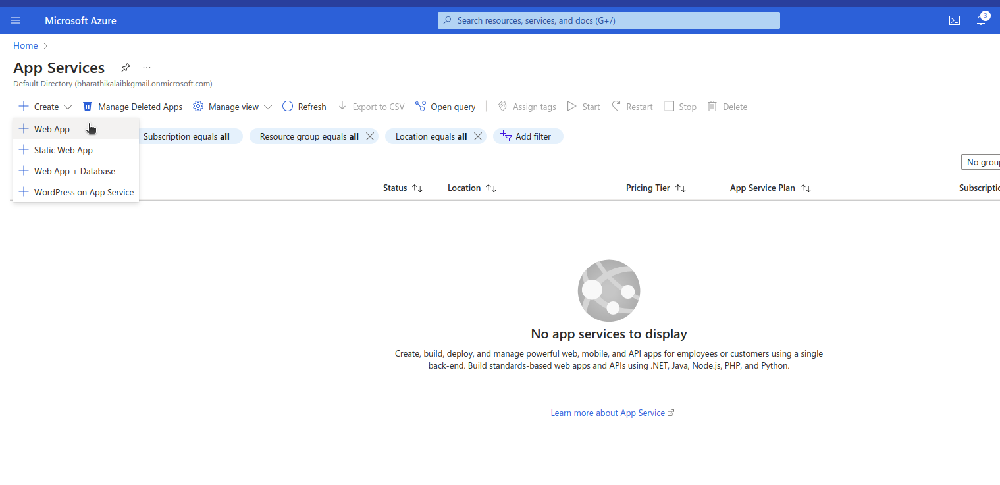
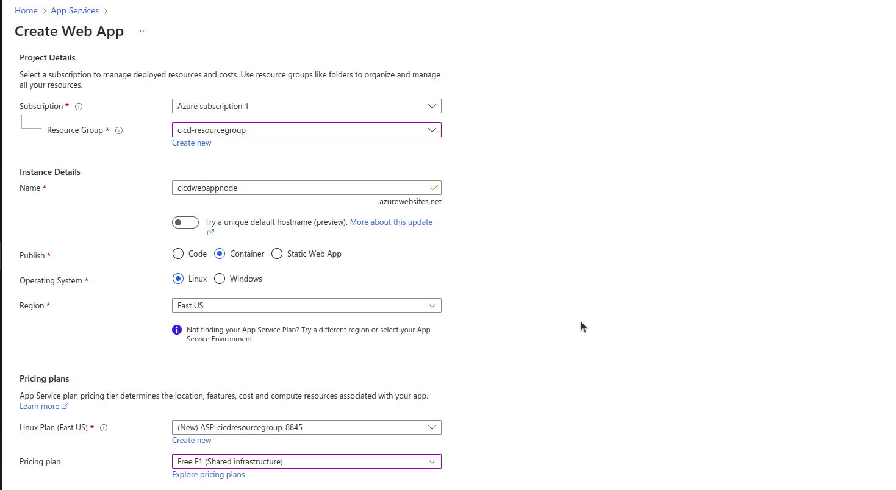
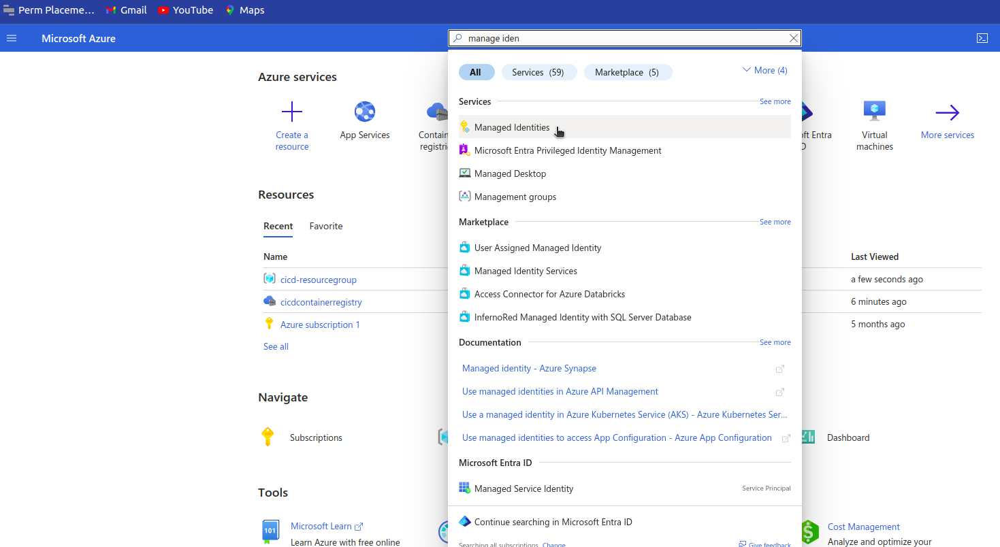
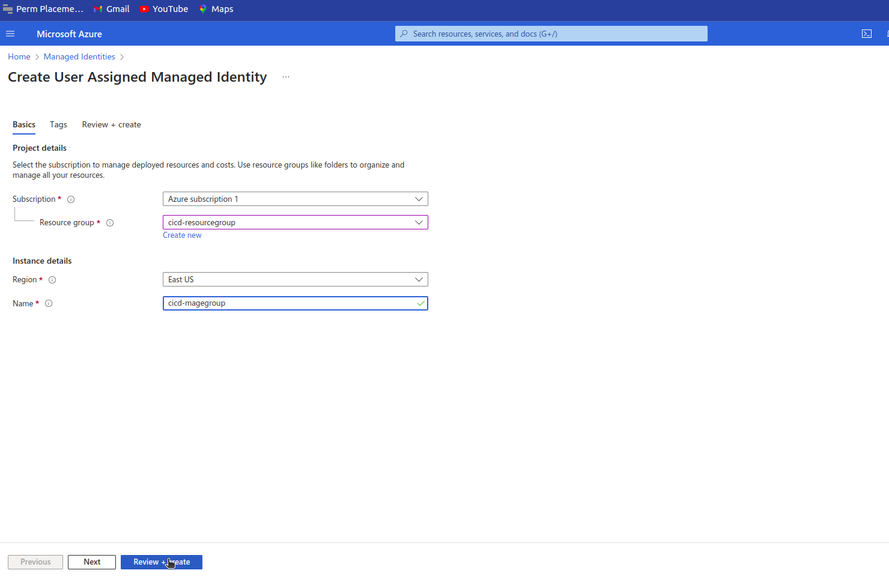
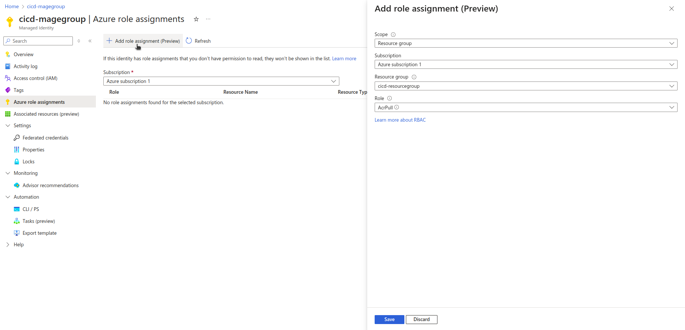
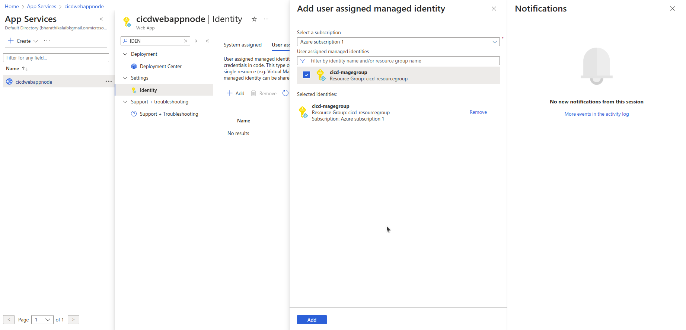

# azure container application cicd

## steps
### 1. create a azure resource group

### azure resource group name (cicd-resourcegroup)

## 2. create a azure container registry

### step 1: search container registry

### step 2: (click review + create button)

## 3. create a app serice

### step 1: search app service

### step 2: click create button and select web app

### step 3: choose container and click review + create button

## 4. create manage identity 

### step 1: search manage identity

### step 2: click review + create button

### step 3: open the manage identity and assign the role called ACRPULL

## 5. add the manage identity resource group to the app service

